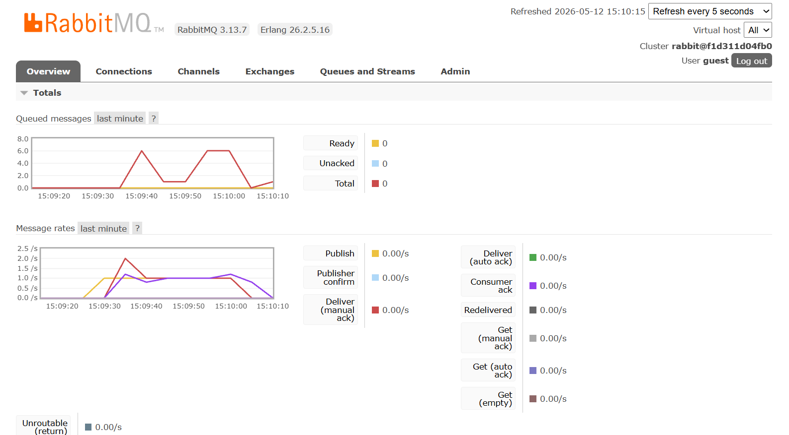
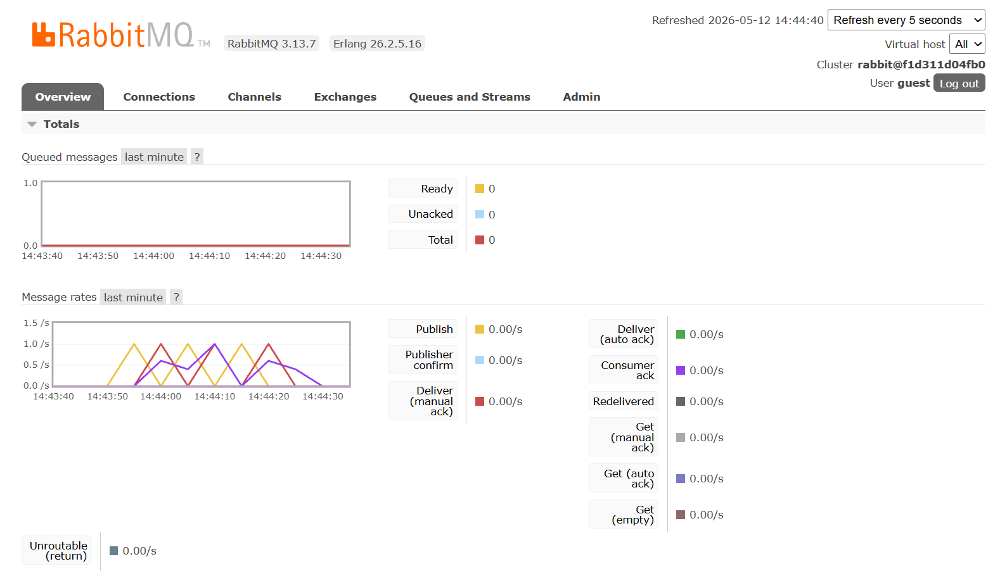

## Questions

a. What is amqp?
= amqp stands for Advanced Message Queuing Protocol. It is an open standard application layer protocol for message-oriented middleware. The AMQP protocol defines how messages are formatted, transmitted, and processed between different systems. It provides a way for applications to communicate with each other by sending messages through a message broker, which can route and manage the messages based on various criteria. AMQP is designed to be flexible and scalable, making it suitable for a wide range of applications, including distributed systems, microservices, and cloud-based architectures.

b. What does it mean? guest:guest@localhost:5672, what is the first guest, and what
is the second guest, and what is localhost:5672 is for?
= In the context of AMQP, "guest:guest@localhost:5672" is a connection string that specifies the credentials and address for connecting to an AMQP broker (such as RabbitMQ). The first "guest" is the username, the second "guest" is the password, "localhost" is the hostname of the broker, and "5672" is the port number on which the broker is listening. This connection string is commonly used for local development and testing, as it allows you to connect to a broker running on your local machine with default credentials. In a production environment, you would typically use different credentials and specify the appropriate hostname and port for your AMQP broker.

## Simulating Slow Subscriber

In my machine, the total number of queue peaked at 6, which means that at one point in time, there were 6 messages in the queue waiting to be consumed by the subscriber. This happened because I simulated a slow subscriber by adding a delay of 1 second in the message handling process. As a result, when I ran the publisher program multiple times in quick succession, it sent multiple messages to the rabbitMQ server before the subscriber had a chance to consume them, leading to an accumulation of messages in the queue. The total number of queue reflects the number of messages that are waiting to be processed by the subscriber, and in this case, it peaked at 6 due to the combination of rapid message publishing and the intentional delay in message processing.

## Running multiple subscriber

The spike of the message queue is reduced when I run multiple subscriber program. This is because when I run multiple subscriber programs, they can consume messages from the queue concurrently, which helps to reduce the number of messages waiting in the queue. Each subscriber program can process messages independently, so when one subscriber is busy processing a message, the other subscribers can still consume messages from the queue. This leads to a more efficient processing of messages and helps to prevent the accumulation of messages in the queue, resulting in a reduced spike in the total number of messages waiting in the queue.

Regarding the code of publisher and subscriber, one improvement that can be made is to implement error handling in the publisher program. Currently, the publisher program does not handle any potential errors that may occur when publishing messages to the message broker. It would be beneficial to add error handling logic to catch and handle any exceptions that may arise during the publishing process, such as connection issues with the message broker or serialization errors when converting the message to a format suitable for transmission. This would help to ensure that the publisher program can gracefully handle any issues that may occur and provide feedback on the success or failure of message publishing.